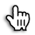

# ImgNote 

## Shortcuts

### Edit
| Action               | Windows                                                  | macOS                                                    |
| -------------------- | -------------------------------------------------------- | -------------------------------------------------------- |
| Add new note point   | a +  | a +  |
| Drag note point      | d +  | d +  |
| Increase size        | Alt + ↑                                                  | ⌥ + ↑                                                    |
| Decrease size        | Alt + ↓                                                  | ⌥ + ↓                                                    |
| Delete selected note | Ctrl + ⌫                                                 | ⌘ + ⌫                                                    |

### View
| Action                | Windows | macOS |
| --------------------- | ------- | ----- |
| Change mode to center | Alt + 0 | ⌥ + 0 |
| Change mode to left   | Alt + 1 | ⌥ + 1 |
| Change mode to top    | Alt + 2 | ⌥ + 2 |
| Change mode to right  | Alt + 3 | ⌥ + 3 |
| Change mode to bottom | Alt + 4 | ⌥ + 4 |

### File
| Action        | Windows  | macOS |
| ------------- | -------- | ----- |
| Export        | Ctrl + e | ⌘ + e |
| Load new data | Ctrl + i | ⌘ + i |
| Download      | Ctrl + d | ⌘ + d |
| Save          | Ctrl + s | ⌘ + s |

## Need Improve

- Point shape (ex: computer, table, printer,...) 
